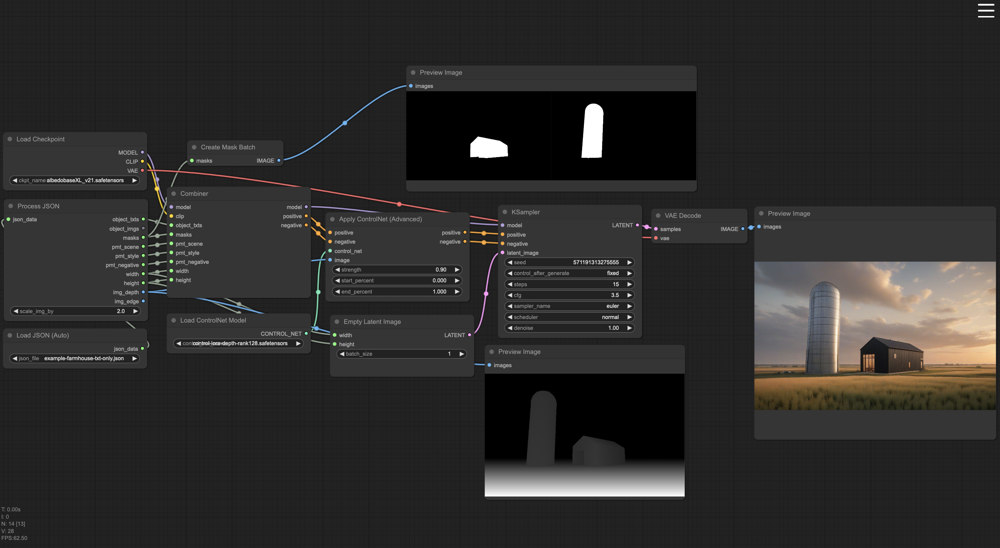

<div align="center">
   <h1>Pseudocomfy Custom Nodes</h1>
  
</div>

### A ComfyUI custom nodes package that enables multi-regional prompting for architectural rendering that works with the Rhino Pseudorandom plugin.




## Spatial-package (input JSON) format example:
   ```sh
      {
         "width": 0,
         "height": 0,
         "pmts_environment": 
         {
            "pmt_scene" : "a prompt describing the scene as a whole",
            "pmt_style" : "a prompt describing the rendering style",
            "pmt_negative" : "a prompt describing what should not be in the render",
         },
         "map_semantic": 
         [
            {
               "pmt_txt": "an text prompt for the object, MAY BE NULL or EMPTY",
               "pmt_img": "BASE 64 ENCODED BITMAP of a guidence image, MAY BE NULL OR EMPTY", 
               "mask": "BASE 64 ENCODED BITMAP",
               "pct": 0.00 
            },
            {
               "pmt_txt": "an text prompt for the object, MAY BE NULL or EMPTY",
               "pmt_img": "BASE 64 ENCODED BITMAP of a guidence image, MAY BE NULL OR EMPTY", 
               "mask": "BASE 64 ENCODED BITMAP",
               "pct": 0.00 
            },
           ...
         ],
         "img_depth": "BASE 64 ENCODED IMAGE",
         "img_edge": "optional BASE 64 ENCODED IMAGE"
         "pseudorandom_spatial_package_version": "{{schema version that this package adheres to in x.xx format}}",	
      }
   ```

---

### --Manual installation instructions--

**IMPORTANT:** If you're using the Windows portable version of ComfyUI, which includes an embedded Python environment, you will first need to install the `diffusers` module:

### 1. Install the `diffusers` library for ComfyUI (Windows Portable Version)

   - **Locate your main `ComfyUI_windows_portable` directory.**
      - It might be named differently, but this is the main directory where you extracted the ComfyUI portable version. It contains folders like *ComfyUI*, *python_embeded*, and others.

   - **Navigate to the `ComfyUI Windows Portable` Directory via a Command Prompt:**
      - Open a Command Prompt by pressing `Win + R`, or typing `cmd`, and pressing `Enter`.
      - Use the `cd` command to change the current directory to the `ComfyUI_windows_portable` directory. For example:
        ```sh
        cd C:\path\to\your\ComfyUI_windows_portable
        ```

   - **Install the library using the embedded Python interpreter:**
      - While in the `ComfyUI_windows_portable` directory, run the following command:
        ```sh
        .\python_embeded\python.exe -m pip install diffusers
        ```
        it should look like this:
        ```sh
        \ComfyUI_windows_portable>.\python_embeded\python.exe -m pip install diffusers
        ```
        
   - **NOT Windows Portable Version:**
      - if you are using your system Python, virtual environment (or Conda environment), run:
        ```sh
        pip install diffusers
        ```
These steps will ensure that the **diffusers** module is installed **within the embedded Python environment used by ComfyUI.**

---

### 2. Install a ControlNet model
There are many places you can download depth ControlNet models, but the one we recommend is `diffusion_pytorch_model.safetensors` from [Hugging Face](https://huggingface.co/lllyasviel/sd-controlnet-depth/tree/main).

To do this:
1) **Download the model:**
   - Download the `diffusion_pytorch_model.safetensors` file from the link above (https://huggingface.co/lllyasviel/sd-controlnet-depth/tree/main).

2) **Move the model to the controlnet folder:**
   - After download is comlpete, move the file to the `controlnet` subfolder inside the `models` folder of your ComfyUI directory:
     ```sh
     C:\path\to\your\ComfyUI_windows_portable\ComfyUI\models\controlnet
     ```
<br>

- **OPTIONAL**
  - **--Additional Sources for ControlNet Models--**
      - **SD-1.5:** You can find depth models here: https://huggingface.co/lllyasviel/ControlNet-v1-1/tree/main. Look for files labeled as `depth`.
      - **SD-XL:** Control-Lora models can be found here: https://huggingface.co/stabilityai/control-lora/tree/main.
      - **You can also install models directly from Comfy Manager**:
        - Open Comfy
        - Go to `Manager > Model Manager (Install Models)`
        - Search using keywords like *"controlnet"* or *"depth"* to find and install the desired models

<br>

---

### 3. Install IPAdapter:
   1. **Install IPAdapter Plus custom nodes in ComfyUI**
      - Open Comfy
      - Go to `Manager > Custom Nodes Manager (Install Custom Nodes)`
      - Search using the keyword *"ipadapter"*
      - Click `Install` on the one called `ComfyUI_IPAdapter_plus` by `cubiq`
   2. **Install CLIP Vision models**
      - go to https://github.com/cubiq/ComfyUI_IPAdapter_plus?tab=readme-ov-file#installation
      - follow the instructions for `/ComfyUI/models/clip_vision` part:
           - download only the first two CLIP Vision models and rename (the file name gets changed when downloading)
      - make sure to move CLIP Vision models to `...\models\clip_vision`
   3. **Install IPAdapter models**
      - navigate to `C:\path\to\your\ComfyUI_windows_portable\ComfyUI\models`
      - inside `models`, create a new folder called `ipadapter`
      - go to https://github.com/cubiq/ComfyUI_IPAdapter_plus?tab=readme-ov-file#installation
      - download the `.safetensors` files of your choice depending on the preferred SD version
           - **IMPORTANT: We recommend _at least_ downloading:**
                - **SD-1.5:** `ip-adapter-plus_sd15.safetensors`, *"Plus model, very strong"* version
                - **SD-XL:** `ip-adapter-plus_sdxl_vit-h.safetensors`, *"SDXL plus model"* version
      - move the downloaded files to newly created ipadapter folder `...\models\ipadapter`

---

### 4. Make sure you have the SD models (checkpoints)
   **We recommend:**
   - **For SD-1.5:** https://civitai.com/models/104608/ai-angel-mix
   - **For SD-XL-1.0:** https://civitai.com/models/140737/albedobase-xl

---

### 5. Last, clone the Pseudorandom repository:
Clone this repo inside your `custom_nodes` folder by:
   1. **Navigate to:** `C:\path\to\your\ComfyUI_windows_portable\ComfyUI\custom_nodes`
   2. **Open the folder inside a Command Prompt and type:**
      ```sh
      git clone https://github.com/Pseudotools/Pseudocomfy.git
      ```
   
---

### Acknowledgments

This project incorporates code that has been adapted or directly copied from the following open-source packages:

- **ComfyUI_densediffusion package by Chenlei Hu ("huchenlei")**  
  Original source: [https://github.com/huchenlei/ComfyUI_densediffusion](https://github.com/huchenlei/ComfyUI_densediffusion)

- **ComfyUI_IPAdapter_plus package by Matteo Spinelli ("Matt3o/Cubiq")**  
  Original source: [https://github.com/cubiq/ComfyUI_IPAdapter_plus](https://github.com/cubiq/ComfyUI_IPAdapter_plus)

- **ComfyUI-Impact-Pack package by Dr.Lt.Data ("ltdrdata")**  
  Original source: [https://github.com/ltdrdata/ComfyUI-Impact-Pack](https://github.com/ltdrdata/ComfyUI-Impact-Pack)

The code from these packages is used under the terms of their respective licenses, with modifications made to fit the specific requirements of this project. The contributions of these developers are greatly appreciated, and their work has been instrumental in the development of this project.
